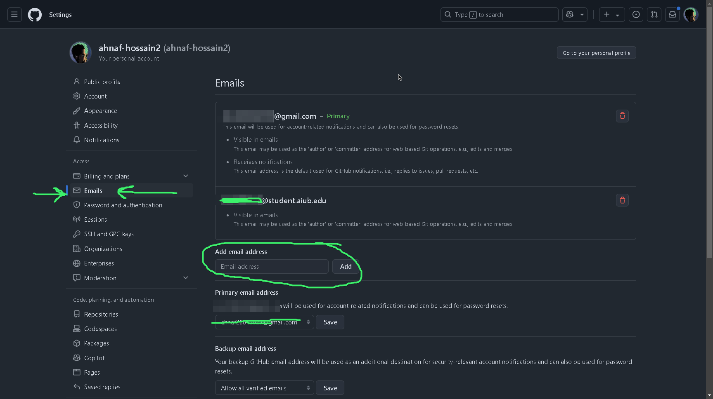

# GitHub Student Developer Pack Setup Guide
Hey everyone! Today I'm going to show you how to apply for GitHub Student Developer Pack, which is completely free for students. This pack includes amazing developer tools and services worth thousands of dollars, so let's get started!
A comprehensive guide to help students activate their GitHub Student Developer Pack and access premium development tools for free.
If this repo is helpful to you then please consider giving it a star ⭐

## 📚 Table of Contents
- [Prerequisites](#prerequisites)
- [Step-by-Step Guide](#step-by-step-guide)
- [Verification Process](#verification-process)
- [Common Issues](#common-issues)
- [Benefits](#benefits)
- [Resources](#resources)

## Prerequisites
Before starting the process, ensure you have:
- A valid student email address
- A current student ID card
- A device with a camera (for ID verification)
- Any web browser

## Step-by-Step Guide

### 1. Create GitHub Account
1. Visit [GitHub.com](https://github.com)
2. Click "Sign Up"
3. Enter your details:
   - Email (preferably student email)
   - Strong password
   - Unique username

4. Verify your student email address (xx-xxxxx-xx@student.aiub.edu)

### 2. Enable Two-Factor Authentication
Two-factor authentication is required for GitHub accounts. To set it up:
1. Go to Settings → Security
2. Click "Enable two-factor authentication"
3. Choose your preferred method:
   - Authenticator app (recommended)
   - SMS authentication
4. Save recovery codes in a secure location

### 3. Apply for Student Developer Pack
1. Visit [GitHub Education](https://education.github.com/pack)
2. Click "Get your pack"
3. Select "Student"

4. Choose your academic institution
5. Complete the verification process

## Verification Process

### Required Documentation
- Clear photo of your student ID
- Access to your academic email

### Best Practices for ID Submission
- Ensure all text is clearly readable
- Include both sides if necessary
- Make sure the photo is well-lit
- Remove any sensitive information not required for verification

## Common Issues

### Application Rejected?
1. Verify your academic email is current
2. Ensure ID card shows valid dates
3. Check image quality of submitted documents
4. Wait 24 hours before reapplying
5. Also apply again from you college or university location of which email you are using to apply.

### Troubleshooting
- Clear browser cache and cookies
- Use a different browser
- Contact GitHub Support if issues persist

## Benefits

### Developer Tools Included
- Private repositories
- GitHub Copilot
- AWS credits
- JetBrains IDEs
- Microsoft Azure credits
- And many more...

### Duration
- Benefits typically last for the length of your academic program
- Renewable with valid student status

## Resources
- [GitHub Education Documentation](https://docs.github.com/education)
- [GitHub Support](https://support.github.com)
- [GitHub Student Community](https://education.github.community/)

## Contributing
Feel free to contribute to this guide by:
1. Forking the repository
2. Creating a new branch
3. Making your changes
4. Submitting a pull request

## License
This guide is licensed under the MIT License - see the [LICENSE](LICENSE) file for details.

---
📝 Last Updated: February 2025
⭐ If this guide helped you, please consider giving it a star!
